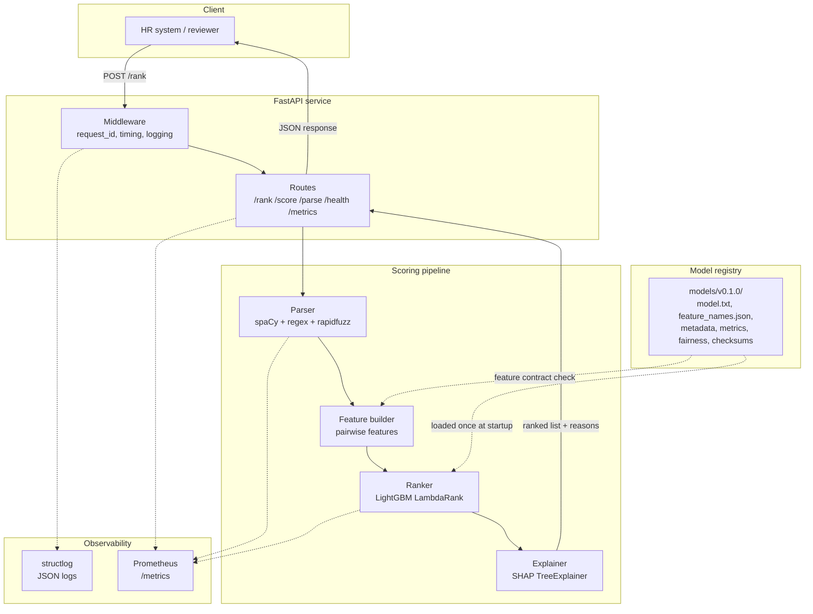
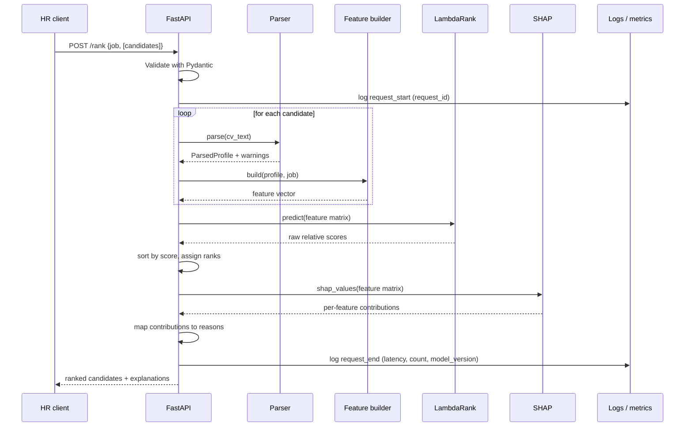
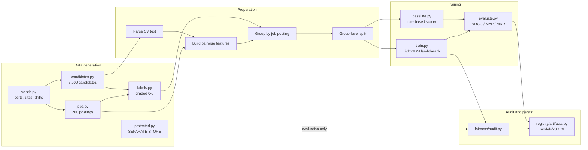
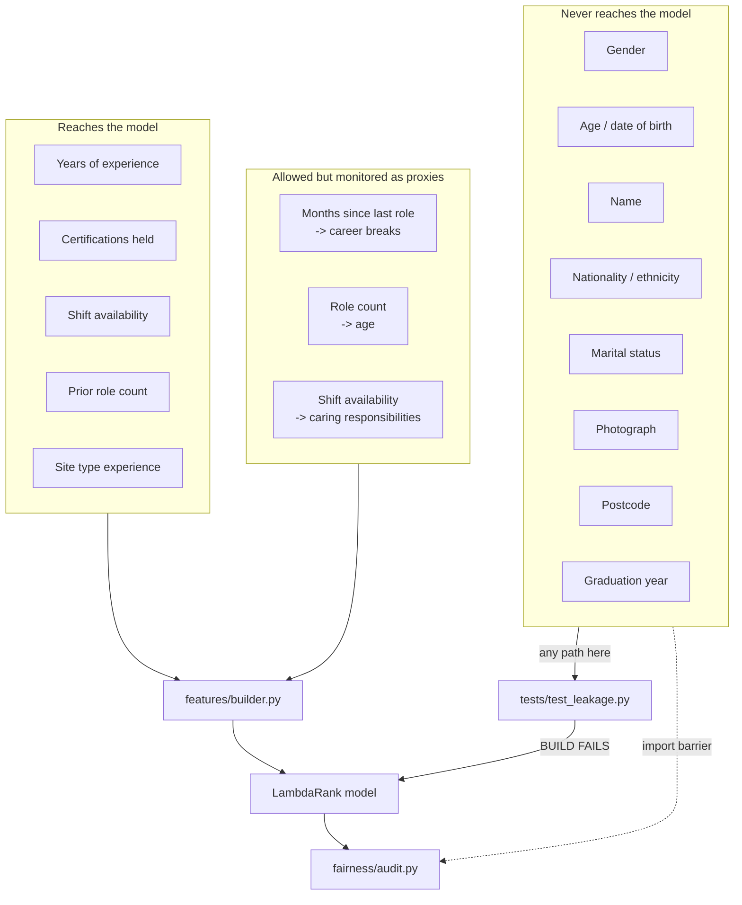
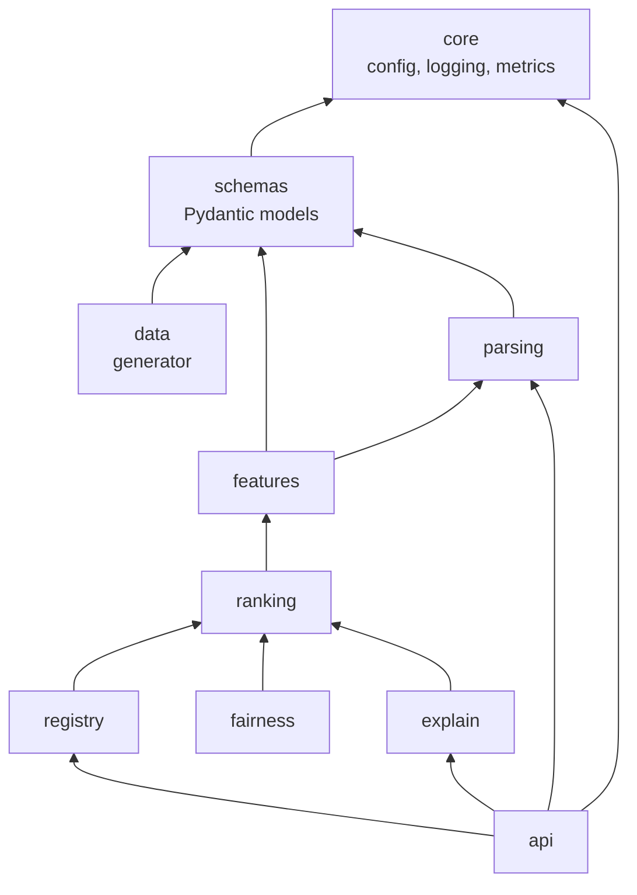
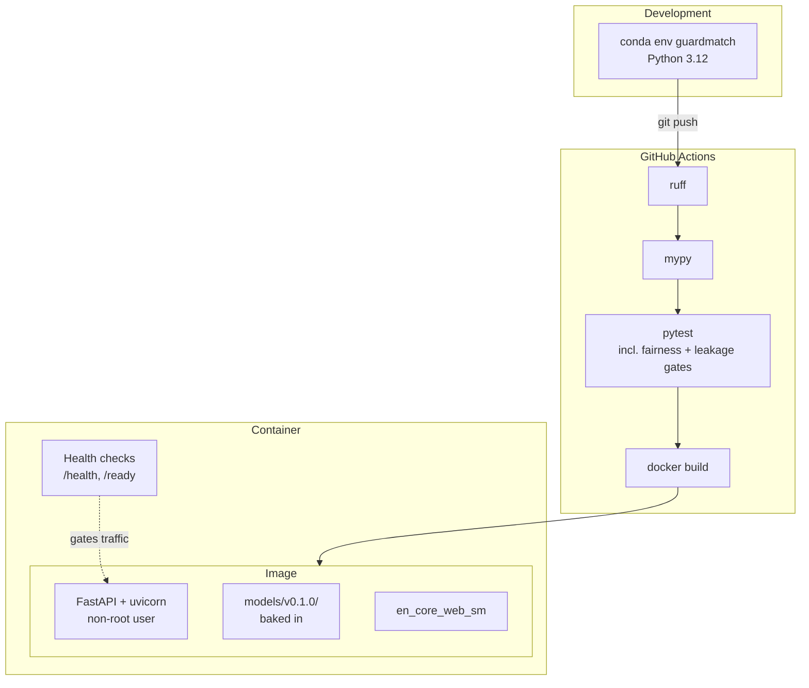

# GuardMatch AI — Architecture

**Companion to:** [design-doc.md](design-doc.md)
**Date:** 2026-08-15

This document holds the structural view of the system: how components fit together, how a
request flows, how the model is trained, and where the boundaries that protect fairness are
drawn.

---

## 1. System Overview

Solid arrows carry request data. Dotted arrows are configuration and observability, which do
not sit on the request path.

The pipeline is strictly linear. Each stage has one responsibility and hands a typed object
to the next, so any stage can be tested in isolation.

---

## 2. Request Flow

Two details worth noting.

Ranks are assigned **after** sorting the whole set, not per candidate — ranking is inherently
a set operation, which is also why LambdaRank is the right objective.

SHAP runs on the full feature matrix in one call rather than per candidate. TreeExplainer is
vectorised, and a per-candidate loop would dominate the latency budget.

---

## 3. Training Pipeline

`protected.py` connects only to the fairness audit, with a dotted line, and never reaches
`FEAT2`. That absence is the whole point of the diagram.

The baseline and LambdaRank both feed the same evaluation step so that their scores are
computed on identical data with identical metrics.

---

## 4. Fairness Boundary

Three separate mechanisms appear here, and they are deliberately redundant.

The **import barrier** means protected attributes live in a module the feature package does
not import, so reaching them requires adding an import that does not exist.

The **leakage gate** is a test that fails the build if a blocked field appears in the feature
set anyway.

The **audit** measures outcomes by group, catching indirect discrimination through proxies
that neither of the first two mechanisms can see.

Prevention alone is insufficient because proxies exist. Measurement alone is insufficient
because it only detects harm after it has been learned.

---

## 5. Module Dependencies

Arrows point from dependent to dependency. The graph is acyclic, and `core` and `schemas` sit
at the bottom with no dependencies of their own.

`features` does not depend on `data`. This matters: the feature builder must work identically
on generated training data and on real CV text arriving through the API, so it cannot know
anything about how training data was produced.

---

## 6. Deployment

Model artifacts are baked into the image rather than mounted, so a running container fully
describes the model it is serving. Rolling out a new model means deploying a new image, which
keeps the deployment history and the model history in step.

The readiness probe fails until the model has loaded and its checksums have verified, so an
instance whose artifacts are broken never receives traffic.
