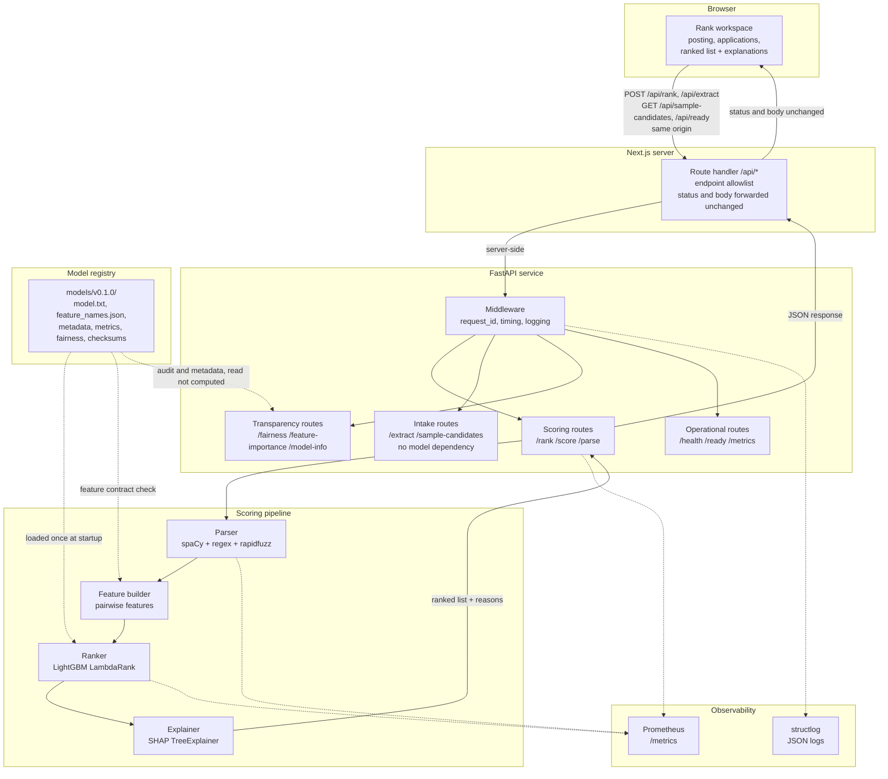
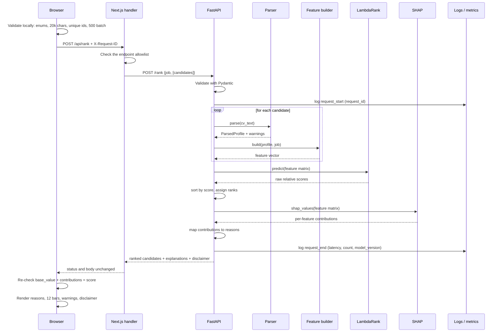
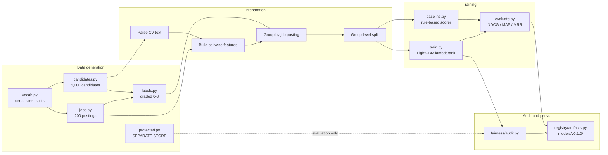
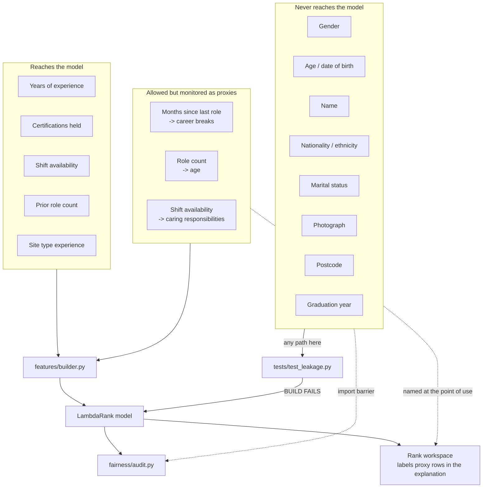
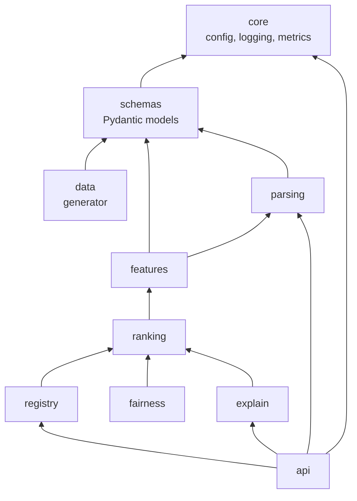
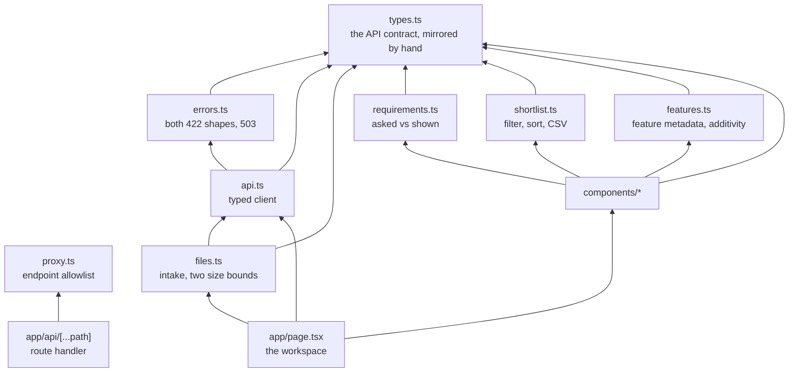
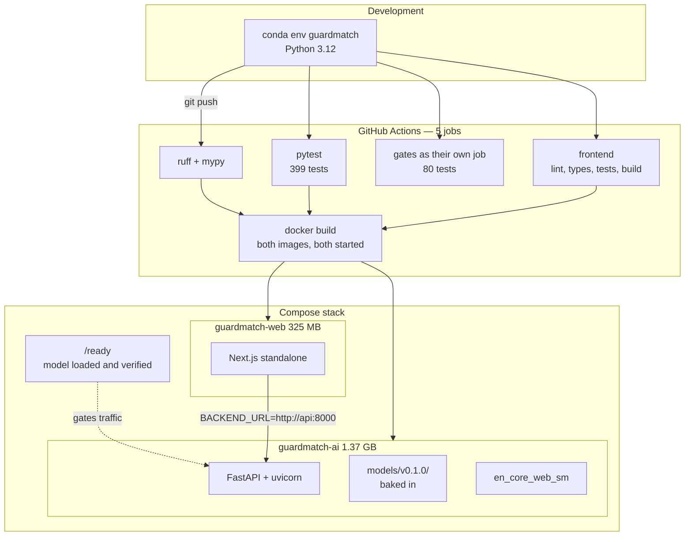

# GuardMatch AI — Architecture

**Companion to:** [design-doc.md](design-doc.md)
**Date:** 2026-08-15

This document holds the structural view of the system: how components fit together, how a
request flows, how the model is trained, and where the boundaries that protect fairness are
drawn.

Module and test paths in the diagrams below are written in shorthand and are relative to
`backend/` — `features/builder.py` means `backend/src/guardmatch/features/builder.py`. Paths
shown inside the container are the container's own, not the repository's.

---

## 1. System Overview

Solid arrows carry request data. Dotted arrows are configuration and observability, which do
not sit on the request path.

The pipeline is strictly linear. Each stage has one responsibility and hands a typed object
to the next, so any stage can be tested in isolation.

**The routes are grouped by what they depend on, not by what they are about.** Scoring routes
need a verified model and return `503` without one. Intake routes — `/extract` and
`/sample-candidates` — read a file or generate text, so they answer while the model is still
verifying; a caller can prepare a batch before the service is able to score it. Transparency
routes report what the loaded artifact already carries and compute no new claim about it, which is
why the registry has a dotted arrow to them rather than a solid one.

**Transparency routes have no arrow from the browser.** `/fairness` and `/feature-importance`
answer for server-side callers and for anyone inspecting the service directly; no page renders
them, so they are not in the proxy's allowlist. A dashboard over them was built and removed —
see [the frontend notes](frontend.md) — and the routes outliving the page is the point: the
fairness position is a property of the service, not of a screen.

**The browser has no arrow to the FastAPI service.** Every call it makes goes to the Next.js
route handler on its own origin, which makes the onward call server-side. That is the whole
reason no CORS configuration exists anywhere in the backend: there is no cross-origin request
to permit. The alternative — naming every origin allowed to reach a hiring model — fails
silently when the list is later wrong, because nothing appears broken while access widens.

The handler carries an endpoint allowlist rather than forwarding whatever it is handed.
Without one it is an open relay to everything the service exposes, `/metrics` included, from
any page able to reach this one.

An HR system integrating directly against the API is still a supported caller. It simply does
not appear here, because it does not go through the browser.

---

## 2. Request Flow

The browser validates first, against the same limits the service enforces, so a reviewer meets
a ceiling while typing rather than through a `422`. It is not a substitute for the boundary
check: the service still rejects anything that reaches it malformed, and the client cannot be
trusted to have run.

The last two steps are the point of the whole system. SHAP here is additive — base value plus
every contribution reconstructs the score — so the browser recomputes the sum and displays
whether it holds. Measured deltas run from 0.0e+00 to 1.8e-15, which is JSON rounding rather
than disagreement. An explanation that does not add up to the score it explains is a story
printed beside a number, and the interface can say which one it is holding.

`X-Request-ID` is generated by the browser, preserved by the handler, and echoed by the service
into both the response body and every log line for that request. One identifier therefore spans
all three, which is what turns "the ranking looked wrong" into a report someone can trace.

Two details worth noting.

Ranks are assigned **after** sorting the whole set, not per candidate — ranking is inherently
a set operation, which is also why LambdaRank is the right objective.

SHAP runs on the full feature matrix in one call rather than per candidate. TreeExplainer is
vectorised, and a per-candidate loop would dominate the latency budget.

---

## 3. Training Pipeline

`protected.py` connects only to the fairness audit, with a dotted line, and never reaches
`FEAT2`. That absence is the whole point of the diagram.

The baseline and LambdaRank both feed the same evaluation step so that their scores are
computed on identical data with identical metrics.

---

## 4. Fairness Boundary

Three separate mechanisms appear here, and they are deliberately redundant.

The **import barrier** means protected attributes live in a module the feature package does
not import, so reaching them requires adding an import that does not exist.

The **leakage gate** is a test that fails the build if a blocked field appears in the feature
set anyway.

The **audit** measures outcomes by group, catching indirect discrimination through proxies
that neither of the first two mechanisms can see.

Prevention alone is insufficient because proxies exist. Measurement alone is insufficient
because it only detects harm after it has been learned.

A fourth, weaker mechanism sits in the interface. Each monitored proxy row in the contribution
table is labelled `(proxy)` with its specific exposure, so a reviewer sees that
`shift_match` — the model's single largest input — carries a correlation with caring
responsibilities at the moment it is acting on a candidate, rather than only in the fairness
report. This prevents nothing on its own; it moves a fact from a document nobody has open into
the screen where the decision is being made.

---

## 5. Module Dependencies

Arrows point from a module to what it depends on. The graph is acyclic by construction and the
`fairness` package is deliberately a leaf that nothing on the scoring path imports — a static test
fails the build if any module reachable from `api` ever imports where the demographics live.

**The frontend is a second graph, and the two meet at exactly one place.**

`types.ts` is the root of the frontend graph and is **hand-written rather than generated** from the
OpenAPI schema. That is a deliberate cost: a generated client would track the contract
automatically and would also import whatever the schema happened to say, including fields the
interface must never send. Writing it by hand makes `Candidate` a type that *cannot* carry a
display name, which is what turns the leakage rule into something the compiler enforces.

The only edge between the two graphs is the route handler reaching the service over HTTP. No
frontend module imports anything Python, and no backend module knows the frontend exists — which
is what makes the trust boundary in section 1 a boundary rather than a convention.

Arrows point from dependent to dependency. The graph is acyclic, and `core` and `schemas` sit
at the bottom with no dependencies of their own.

`features` does not depend on `data`. This matters: the feature builder must work identically
on generated training data and on real CV text arriving through the API, so it cannot know
anything about how training data was produced.

---

## 6. Deployment

Model artifacts are baked into the image rather than mounted, so a running container fully
describes the model it is serving. Rolling out a new model means deploying a new image, which
keeps the deployment history and the model history in step.

The readiness probe fails until the model has loaded and its checksums have verified, so an
instance whose artifacts are broken never receives traffic. `web` waits on that probe rather
than on the API process starting, so a reviewer never arrives at a workspace whose backend
cannot answer.

Two build contexts rather than one. `guardmatch-ai` is built from `backend/` and
`guardmatch-web` from `frontend/`, so neither image can grow by picking up the other half of
the repository. Both run as uid 1001 on a read-only root filesystem with `no-new-privileges` —
the same posture on both sides, because a stack is only as constrained as its least
constrained container.

**The verification that matters here failed silently for eleven days.** `models/v0.1.0` was
written on Windows, so its recorded checksums described bytes containing CRLF; git normalised
them to LF, and the artifact then failed verification on every Linux checkout — CI, this
container, and any contributor not on Windows. Startup re-raises by design, so the service
refused to serve. It passed only on the machine that produced the bytes. Artifacts are now
written with LF on every platform and `.gitattributes` marks them `-text`; two tests assert
that no artifact file contains CRLF, one of them checking the artifact **as committed** rather
than one a fixture regenerated. See the model card, section 9.
